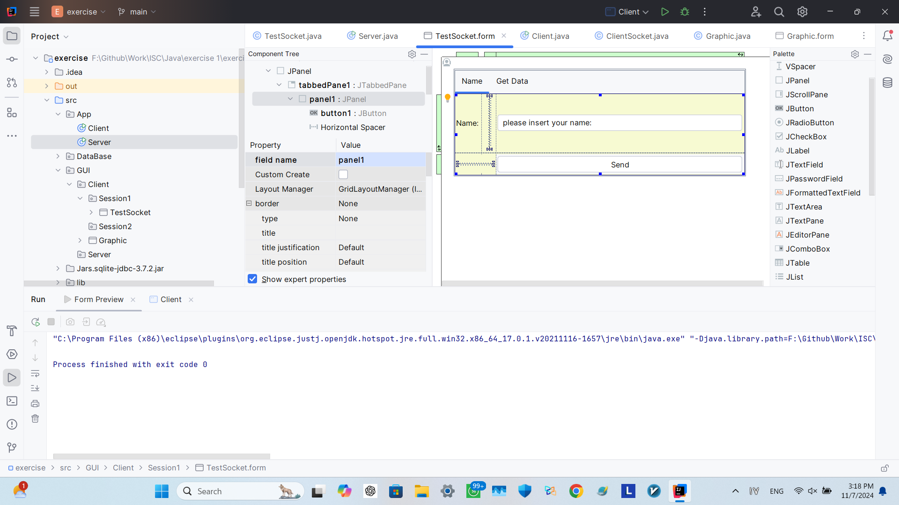
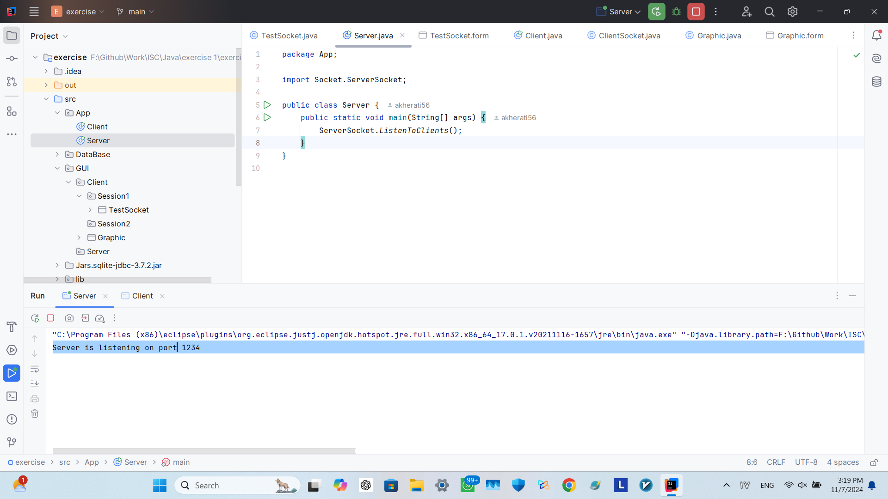
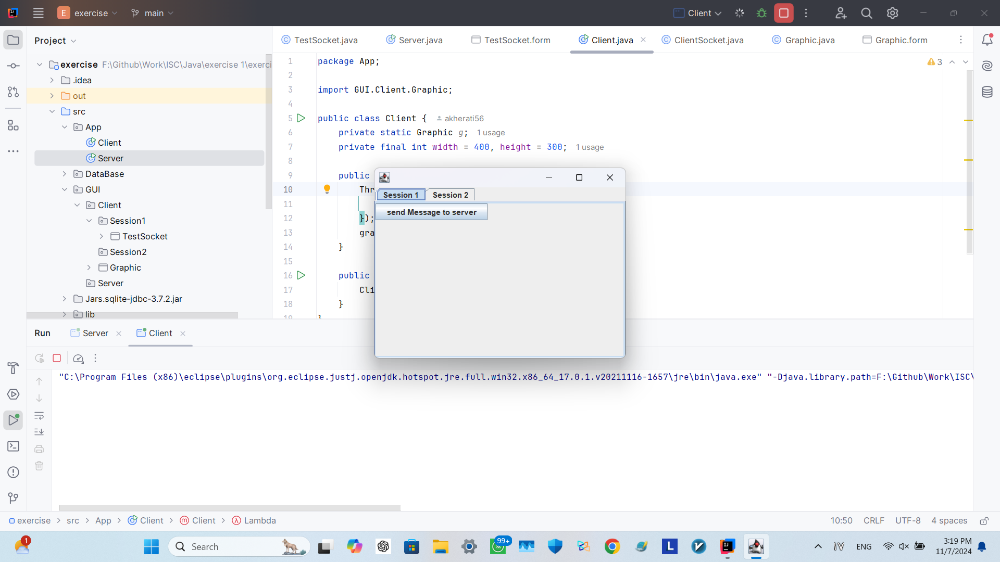
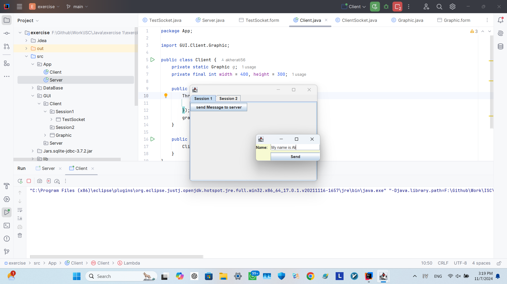
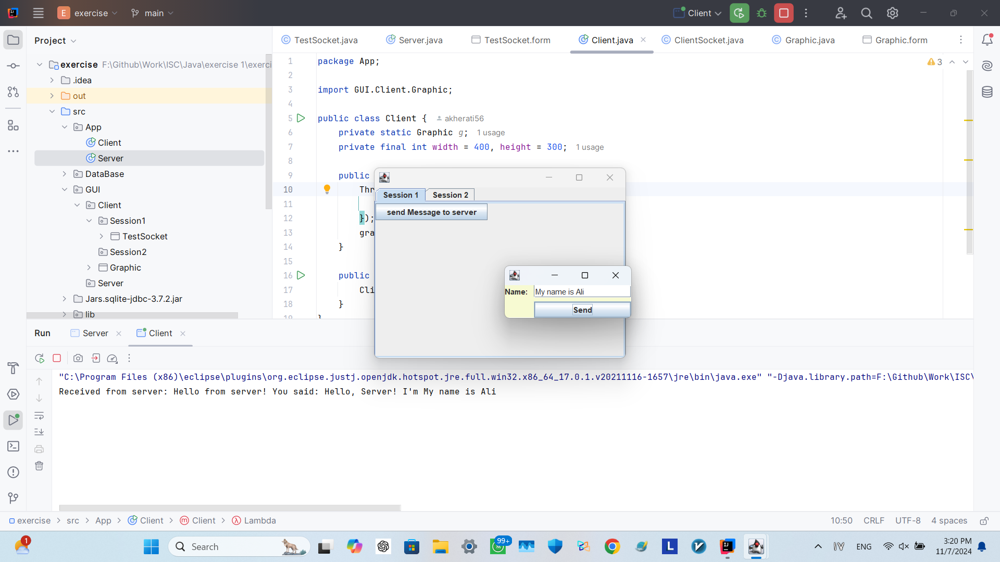
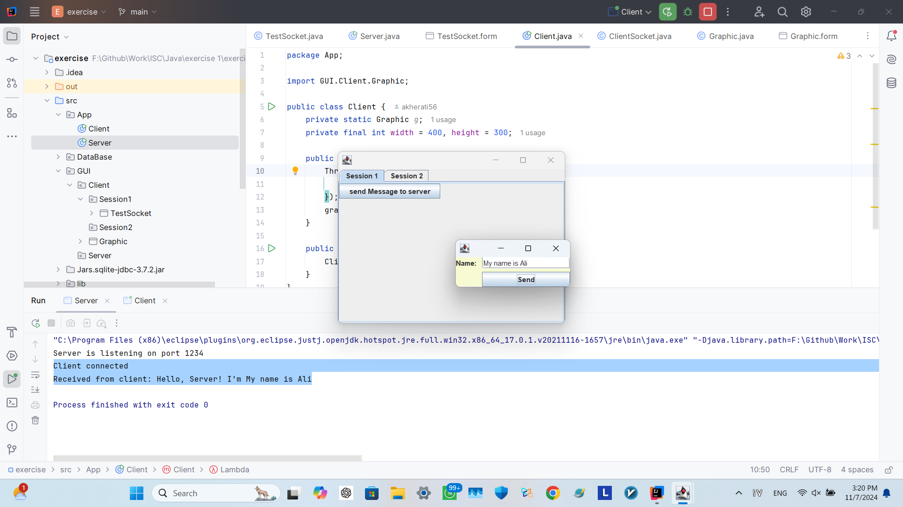

# status: stop
## working on MVC design pattern to reimplement whole project!

## session 1
### list of websites to download jdk 
1. openjdk
3. Adoptium
4. Amazon Corretto
5. Zulu OpenJDK
6. Red Hat OpenJDK
---
### list of java IDEs
1. IntelliJ IDEA
2. Eclipse
3. NetBeans
4. Visual Studio Code
5. BlueJ
6. JDeveloper
7. DrJava
----
Decimal (Fixed-Point) Types
    
    avoiding issues with floating-point inaccuracies.

----
## Session 2

### so far i have no clear plan on how to complete this code but at the end i hope i can achive this goals:

#### i may need to design uml for whole project for better management.
## TODO:

    1. implement thread for multiprocessing with best practise
    2. implement pretty gui window for clients to input data
    3. create connection to server with socket programming
    4. interact with sqlite database on server

## Extra hard TODO: 

    1. upload code into my vps
    2. use public-private key for secure connection
        2.2 if it was possible implement public-private key code

----

## Preview Result - just Socket and GUI

## Form view

## Run Server

## Run Client

## Open Sub Window

## Send Name to Server 

## Result on Server

